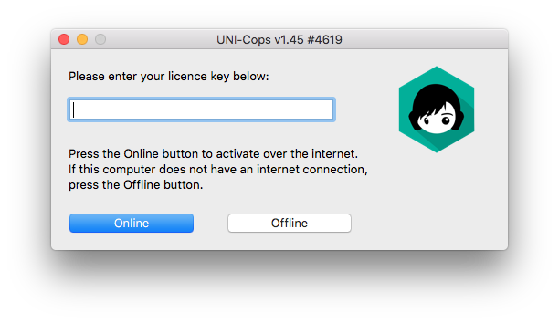

* Install the software on that computer, enter your **License Key** and click on the **Offline** button:

* Send us an email with your Machine ID and License Key to [support@trainyourears.com](mailto:support@trainyourears.com).
* We'll answer you with an **Access Code**.
* Finally, enter your **License Key**, click on the **Offline** button again and enter the **Access Code**.

